# 2025年排名前28的AI搜索引擎汇总(最新整理)

还在为查资料翻遍整个互联网而头疼?传统搜索引擎给你一堆链接,让你自己慢慢筛选,效率低得让人抓狂。现在有了AI搜索引擎和研究助手,直接给你答案、帮你总结文献、甚至能替你做深度调研。无论你是学术研究、技术开发还是日常工作,这些工具都能大幅提升效率,节省时间成本。下面这份清单覆盖了从通用搜索到学术专用的各类场景,帮你找到最适合的那一款。

## **[Perplexity](https://pplx.ai/ixkwood69619635)**

实时联网的对话式AI搜索引擎,提供带引用来源的精准答案。

这家伙把搜索引擎和AI助手完美结合在一起了。你问个问题,它不仅给你答案,还把信息来源标得清清楚楚,每条引用都能点进去验证。Pro Search功能更厉害,能进行多轮深度搜索,自动综合几十个来源的信息。Deep Research模式就像给你配了个专业研究员,几分钟内自动执行几十次搜索、阅读数百个来源、自主推理,最后生成一份完整的研究报告。

**核心能力**包括实时网络搜索、对话式交互、上下文记忆、多模型选择(GPT-5、Claude 4.0 Sonnet等)。界面简洁无广告,答案直接且可验证。免费用户每天有限次数Pro搜索,订阅用户则不受限制。**适合人群:**需要快速获取可靠信息的研究者、内容创作者、学生,以及希望深入了解某个话题的任何人。

## **[ChatGPT Search](https://chatgpt.com/)**

OpenAI推出的集成搜索功能,将实时网络信息引入对话式AI体验。

把ChatGPT的对话能力和实时搜索结合起来,体验相当顺滑。当你的问题需要最新信息时,它会自动触发网络搜索,或者你也可以手动点击搜索按钮。搜索结果会以对话形式呈现,并提供来源链接方便验证。最大的优势是保持了对话上下文,你可以持续追问,它会记住之前说过什么。

搜索速度快,答案准确度高,界面无广告干扰。支持后续提问和调整回复,让搜索变得像和朋友聊天一样自然。免费用户也能用基础功能,Plus订阅用户($20/月)享受更强大的GPT-4o模型和额外特性。**使用场景:**适合喜欢对话式交互而非关键词搜索的用户,尤其是移动端用户想要快速直接的答案。

## **[Google AI Mode](https://search.google/ways-to-search/ai-mode/)**

谷歌搜索的AI增强版本,整合Gemini模型提供深度研究能力。

谷歌终于拿出了自己的AI搜索方案。AI Mode使用"查询扇出"技术,把复杂问题自动拆分成多个搜索,然后综合所有结果给你答案。Gemini 2.5 Pro模型在高级推理、数学和编程问题上表现出色。Deep Search功能能浏览数百个网站、跨信息源推理,几分钟内生成全面引用的研究报告。

深度集成谷歌生态系统,从Google Maps、YouTube到Google Lens都能调用。熟悉的界面让老用户无缝过渡。基础功能免费,Gemini Advanced订阅($19.99/月)解锁高级AI Mode和更多特性。**最佳人群:**重度依赖谷歌服务的用户,想在不换平台的情况下获得AI增强能力。

## **[You.com](https://you.com/)**

AI驱动的个性化搜索引擎,集成多种生产力工具。

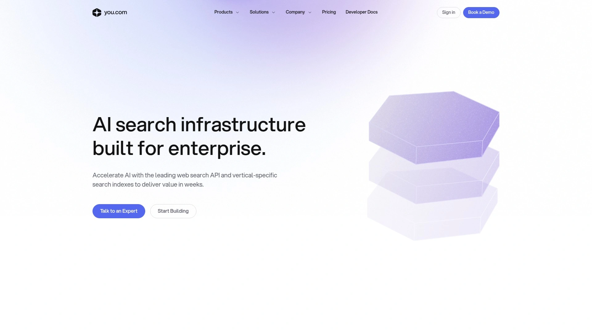

这不只是个搜索引擎,更像是个多功能AI工作站。You.com在搜索结果页面直接嵌入了YouChat(类ChatGPT功能),让你可以在搜索完立即对话询问细节、总结要点或定义术语。还有YouCode帮你写代码、YouWrite生成长短文本、YouImagine创建图像,基本把你需要的AI工具都整合进来了。

自定义能力很强,可以选择不同的AI模型(GPT、Claude、Llama等),还能限制搜索范围到特定网站或上传的文档。搜索深度可调,从快速搜索到深度浏览全页内容都行。注重隐私保护,不追踪用户数据。免费版功能就很够用,YouPro订阅提供无限高级AI功能访问。

## **[Consensus](https://consensus.app/)**

专门搜索学术论文的AI工具,基于2亿+同行评审文献。

如果你做学术研究,Consensus简直是神器。它只从高质量同行评审论文中提取信息,不像通用AI那样从网上随便抓内容。搜索时先检索文献,再用AI总结,确保每个回复都有真实可引用的研究支撑,绝不"编造"来源。

特别擅长回答是非问题,会显示"共识计量器"告诉你有多少研究支持或反对某个观点。AI会分析检索到的论文,生成带引用的学术大纲。还能作为ChatGPT的GPT助手使用,结合ChatGPT的对话能力和Consensus的论文数据库。免费每月20次AI分析,付费版($9/月,学生6折)无限使用。

## **[SciSpace](https://scispace.com/)**

全能型学术AI助手,覆盖文献检索到论文写作全流程。

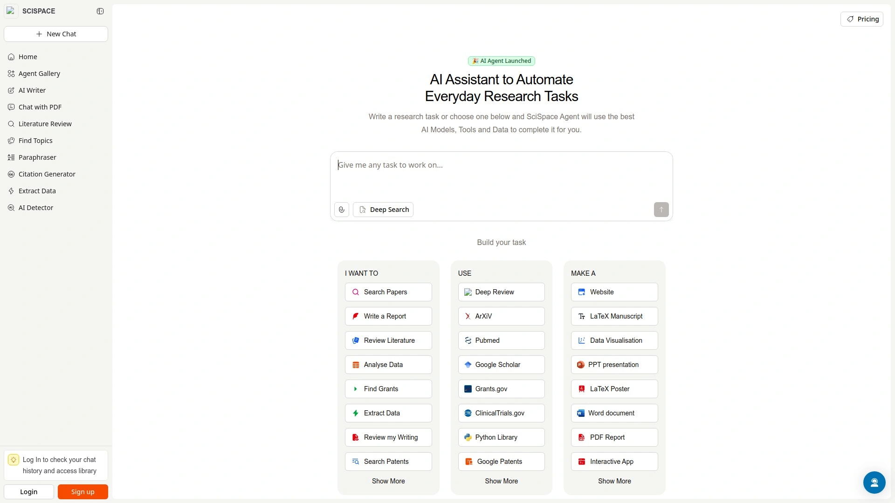

这是个"一站式"学术研究平台。Copilot功能让你能和PDF对话,问它问题、要解释、理解复杂公式和表格,甚至可以用母语获取解释。AI Literature Review把论文总结成结构化对比表,包含TLDR、方法论、核心发现和局限性。AI Paper Writer根据你导入的参考文献生成完整论文段落带正确引用。

语义搜索理解完整研究问题而非仅关键词匹配。集成Zotero等外部工具简化引用管理。Notebooks功能让你把高亮、对话和自己的写作整合到一个文档。支持超过1000种引用格式导出。免费版可用,付费计划从$12/月起。

## **[Brave Search](https://search.brave.com/)**

独立索引的隐私优先搜索引擎,内置AI问答功能。

和那些偷偷依赖谷歌或必应索引的"隐私搜索"不同,Brave Search从零构建了自己的索引,真正独立。Ask Brave功能结合AI聊天和搜索结果页,提供详细答案、后续问题对话、以及上下文相关的视频、新闻、商品等内容增强。每天提供超过1500万次AI答案。

完全不收集用户数据,不可能分享、出售或泄露你的个人信息,因为压根不存。搜索速度快,结果页面简洁无广告(除非你选择看)。社区驱动的排名选项让用户有更多控制权。完全免费使用,在任何浏览器访问search.brave.com即可。

## **[Kagi](https://kagi.com/)**

付费无广告搜索引擎,提供高度定制化搜索体验。

Kagi的商业模式很直接:你付费,我给你最好的搜索结果,不靠广告不追踪你。搜索质量很高,可以对网站结果进行点赞、点踩、甚至彻底屏蔽。Lenses功能让你按类别筛选结果(讨论、播客、PDF、小网站博客论坛等),还能创建自己的Lenses。

自定义能力超强,甚至支持自定义CSS编辑器改界面。搜索速度0.2-0.8秒,处理拼写错误能力强。虽然也加了些AI功能(快速响应、摘要),但重点还是搜索本身。运行自己的爬虫Teclis索引小网站内容。月费$10,无限搜索。

## **[Elicit](https://elicit.com/)**

专为文献综述设计的AI研究助手,自动提取关键信息。

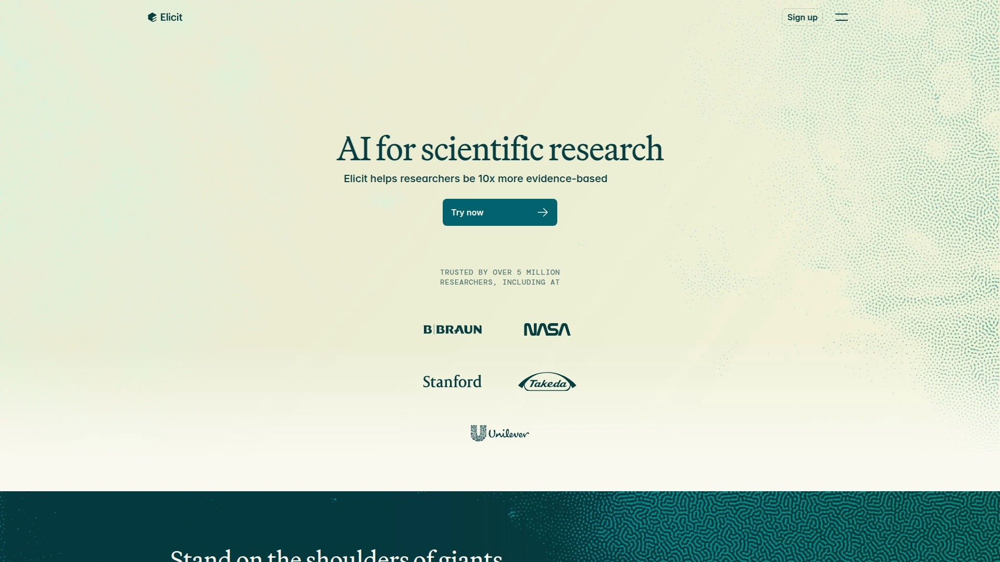

Elicit最擅长的是自动化文献综述流程。你输入研究问题,它找到相关论文,提取标题、摘要、研究类型、参与者数量等元数据,然后总结每篇论文的主要发现。特别适合"X对Y有什么影响?"这类经验性研究问题。

能找到付费墙后面的论文PDF链接。可以添加自定义列指定要提取的数据,比如检查研究是否包含人体试验。高精度模式提高提取准确性(消耗更多积分)。结果可导出CSV文件便于整理文献综述。适合meta分析或系统综述。从Semantic Scholar拉取论文数据。免费可用,专业版提供更多功能。

## **[ResearchRabbit](https://www.researchrabbit.ai/)**

AI驱动的文献地图工具,可视化论文引用关系。

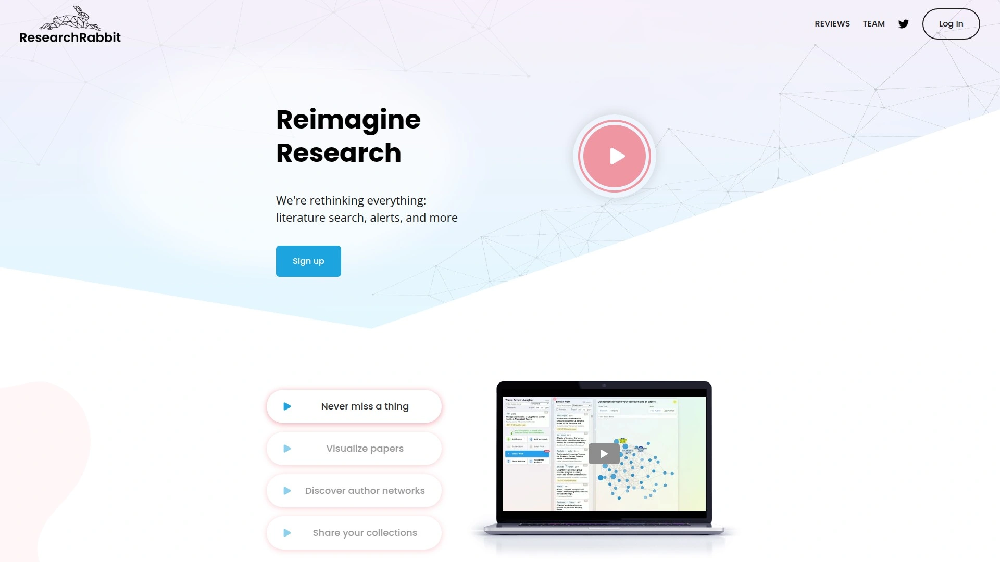

把文献综述变成了可视化冒险。你添加几篇"种子论文"到收藏,ResearchRabbit会学习你的兴趣,持续推荐相关新论文。"探索论文"功能让你查看相似工作、早期工作、后期工作,并用可视化展示它们的连接关系。

可以基于单篇论文或整个收藏组探索文献,查看所有参考文献或所有引用。引用地图让你瞬间看到论文如何相互链接,识别有影响力的作品和研究趋势。支持团队协作,可以分享收藏、添加评论、实时协作。与Zotero无缝集成。完全免费使用。

## **[Semantic Scholar](https://www.semanticscholar.org/)**

AI驱动的学术搜索工具,理解查询语义而非仅匹配关键词。

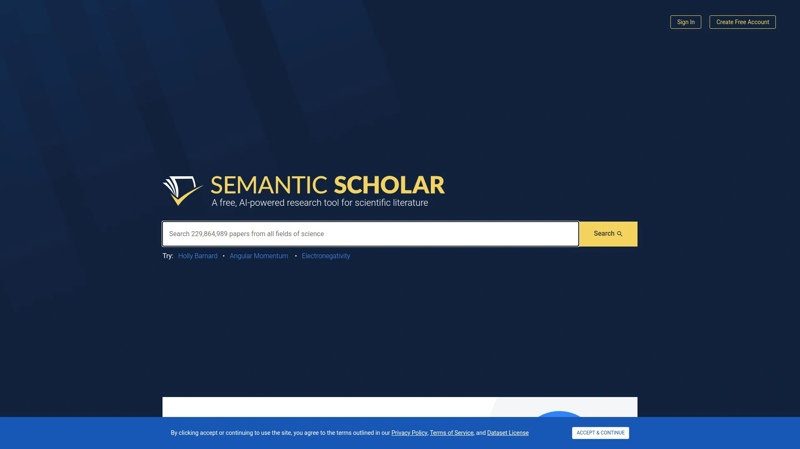

由艾伦人工智能研究所开发的免费学术搜索引擎。利用机器学习和大语言模型理解查询背后的含义,提供比传统关键词搜索更精准的结果。能识别论文中的关键实体(作者、期刊、会议等),提取摘要、图表、引用。

引用图谱可视化论文通过引用的连接关系,帮助追踪思想发展和识别有影响力的工作。基于搜索历史和偏好推荐相关论文。按研究领域索引论文,方便查找特定领域内容。覆盖超过2亿篇论文,包括几乎所有高影响力期刊和PubMed全部内容。完全免费。

## **[Microsoft Copilot](https://copilot.microsoft.com/)**

微软的全能AI助手,整合Bing搜索和GPT-4能力。

从Bing Chat改名而来,现在是微软的统一AI品牌。能搜索网络、生成文本、创建图像(用DALL-E)、写代码,基本你想到的AI任务都能干。Copilot Vision能分析网页中的图片并回答相关问题,比如根据家具照片生成室内设计建议。Copilot Voice让你能语音提问,它也语音回答。

Copilot Daily每天早上生成新闻摘要和天气预报,还能提醒即将到来的事件。Think Deeper功能用最新推理模型处理复杂问题,虽然响应时间长些但能提供详细的分步答案。免费使用,订阅版提供更高使用限额和高级功能。深度整合Office套件(Word、Excel、PowerPoint)。

## **[Phind](https://www.phind.com/)**

专为开发者优化的AI搜索引擎,提供代码解决方案。

如果你是程序员,Phind会让你觉得它懂你。专门理解技术术语和编程上下文,能提供编码解决方案、API文档、故障排除建议。搜索结果包含简洁解释和相关代码片段,还附带参考链接让你深入研究。

VS Code扩展让AI无缝集成到工作流。可以高亮代码请求解释、调试或重构,用快捷方式获取内联建议和快速修复。内置网络搜索拉取相关文档不用离开编辑器。支持后端(Python、Java、C++、Rust、Go)、前端(React、Angular、Vue)、数据库、云平台等几乎所有编程语言和框架。使用Phind-70B和GPT-4模型。

## **[Paperguide](https://paperguide.ai/)**

端到端AI研究助手,支持从文献检索到论文写作全过程。

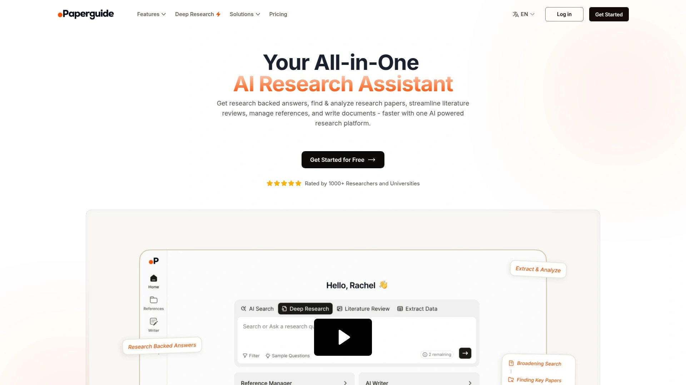

这是个野心很大的全能平台。AI Search语义搜索理解完整研究问题,从2亿+学术论文中检索带引用的答案。Deep Research AI全自动执行系统综述。AI Literature Review把选定论文总结成结构化表格,字段包括TLDR、方法论、核心发现、局限性。

AI Paper Writer利用导入的参考文献帮你起草和精炼学术文本,生成完整论文段落带正确引用。AI Reference Manager导入参考文献(BibTeX、DOI等),组织到文库,为每个生成AI摘要。Chat with PDF功能让你上传PDF并提问,答案带原文直接引用。Extract Data自动从多篇论文提取数字、表格、图表。免费版可用,付费计划$12-24/月。

## **[Gemini Deep Research](https://gemini.google/overview/deep-research/)**

谷歌的AI深度研究功能,数分钟内生成全面研究报告。

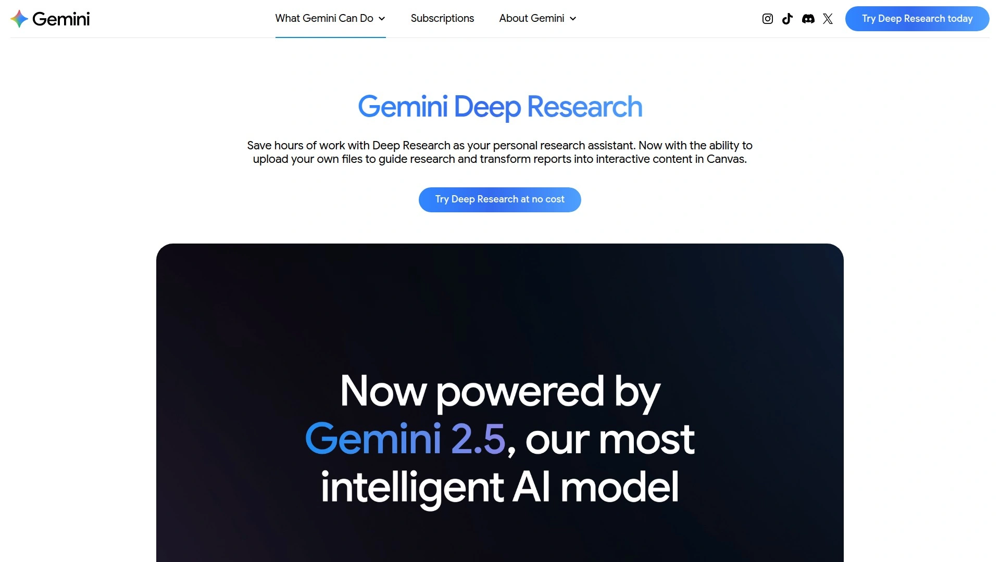

这是Gemini最高级的研究工具。能浏览数百个网站,跨不同信息片段推理,几分钟内生成全面引用的综合报告。对工作、爱好、学习相关的深度研究特别有用,做重大生活决策(买房、财务分析等)时也很给力。

使用Gemini 2.5 Pro模型,在高级推理、数学、编程问题上表现优异。自动执行数百次搜索,自主推理材料,2-4分钟交付报告。整合了Google Search和网络技术的最佳能力。目前向Google AI Pro和AI Ultra订阅用户(美国地区)逐步推出,通过AI Mode中的Labs实验访问。

## **[DuckDuckGo](https://duckduckgo.com/)**

隐私保护搜索引擎,不追踪用户搜索历史。

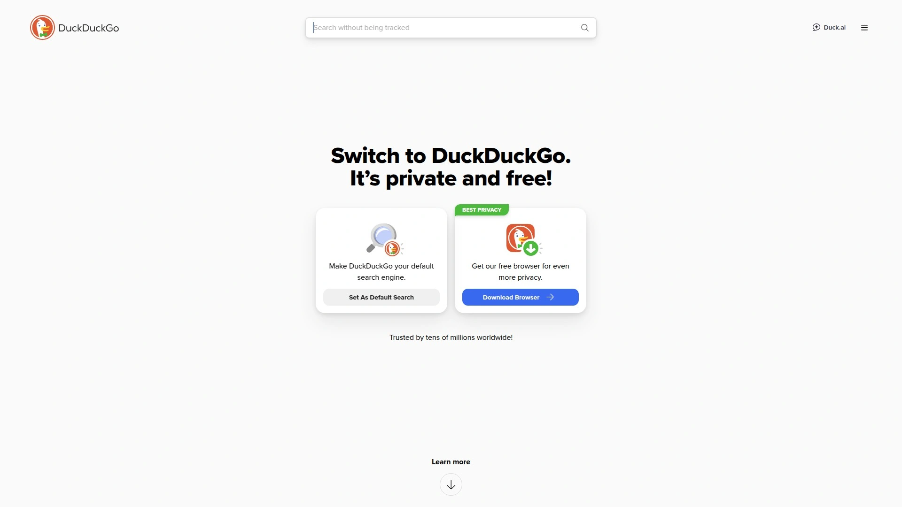

老牌隐私搜索的代表,承诺不收集、不分享用户数据。搜索结果来自多个来源包括必应,但加了隐私保护层。界面简洁无个性化追踪广告。虽然没有自己的AI问答功能(像其他新工具那样花哨),但胜在稳定可靠。

提供浏览器和浏览器扩展,进一步增强隐私保护。搜索质量对日常查询来说足够好。移动应用也很流畅。适合注重隐私、不想被追踪的用户。完全免费,无需注册。

## **[Scite.ai](https://scite.ai/)**

智能引用工具,显示论文被支持还是反驳的引用情况。

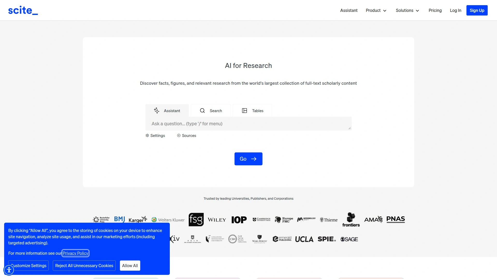

这个工具的特色是"智能引用"(Smart Citations)。不只告诉你论文被引用了多少次,还分析这些引用是支持、反驳还是仅仅提及原论文。这对评估研究可靠性和影响力超级有用,能看出学界对某个发现的真实态度。

帮助研究者更好理解科学文献的背景和可信度。搜索覆盖大量学术数据库。可以生成引用报告,分析特定论文的引用模式。适合做文献综述、评估研究质量的学者。提供免费试用,完整功能需订阅。

## **[Litmaps](https://www.litmaps.com/)**

可视化文献地图工具,追踪研究趋势和发现相关论文。

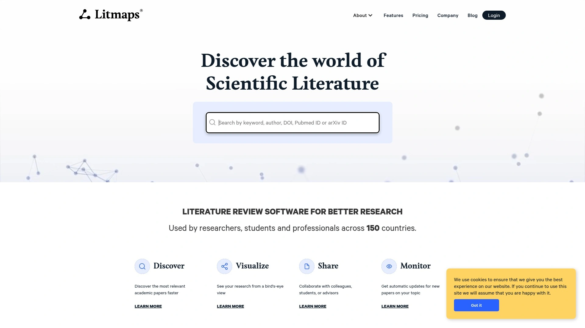

和ResearchRabbit类似,Litmaps也是文献可视化工具但侧重点略不同。创建文献地图展示论文之间的引用关系,可以看到研究领域如何随时间演变。追踪功能会在有新相关论文发表时通知你。

可视化做得很漂亮,容易识别研究中的关键节点和分支。支持导出和分享地图。与Zotero等引用管理工具集成。适合需要把握研究全局、追踪最新进展的研究者。有免费版,高级功能需订阅(用代码可享折扣)。

## **[Connected Papers](https://www.connectedpapers.com/)**

论文关系可视化工具,构建相似研究的图谱。

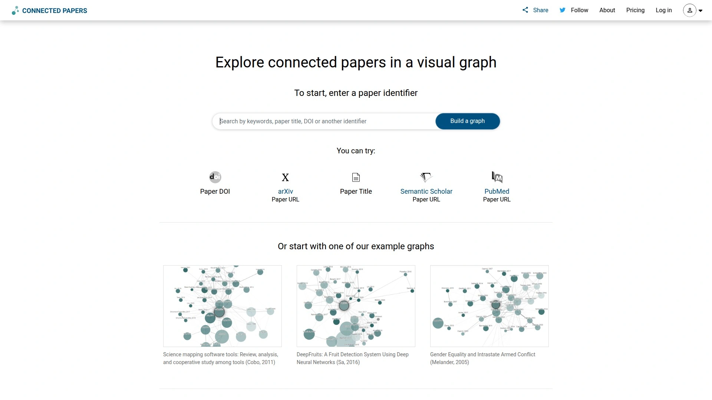

输入一篇论文,Connected Papers会生成一个可视化图谱,展示与之最相关的论文。不同于简单的引用关系,它用算法分析论文相似度,帮你发现可能被忽略但重要的相关研究。

图谱按时间排列,可以清晰看到研究领域的发展脉络。每个节点大小表示论文被引次数,颜色表示发表年份。界面直观易用,适合快速了解某个主题的研究全景。免费使用,每月有查询限制。

## **[Google Scholar](https://scholar.google.com/)**

最广为人知的学术搜索引擎,覆盖海量文献。

虽然是老面孔,但Google Scholar依然是很多研究者的首选。覆盖范围广,从期刊文章到学位论文、书籍、会议论文都有。引用追踪功能让你可以看哪些后续研究引用了某篇论文。创建个人学术档案追踪自己的引用指标。

完全免费,无需登录就能搜索。可以设置图书馆链接,方便访问机构订阅的全文。高级搜索支持按作者、期刊、日期等筛选。虽然没有炫酷AI功能,但在全面性和可靠性上难以被替代。

## **[Bing](https://www.bing.com/)**

微软搜索引擎,现在整合了Copilot AI助手。

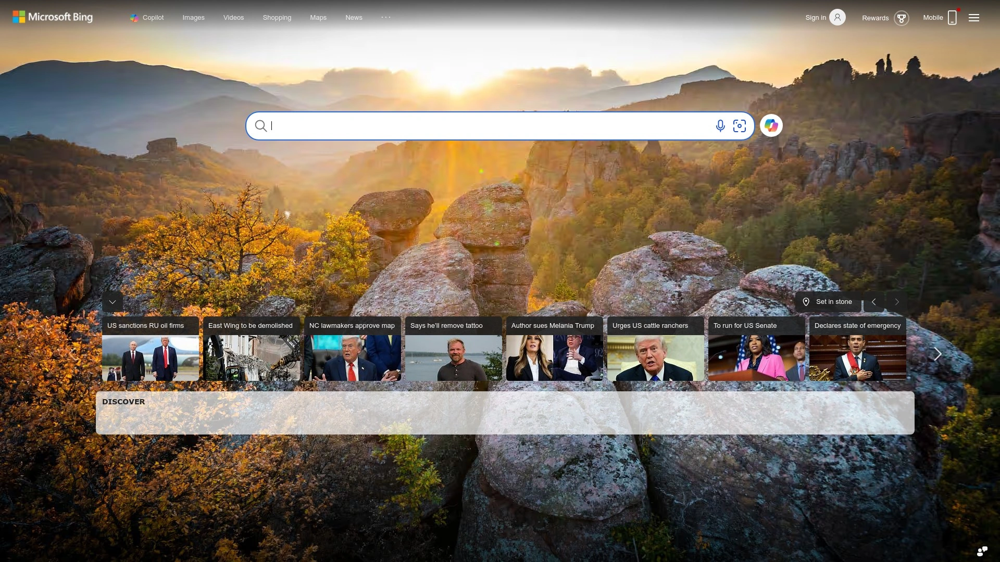

必应现在和Copilot深度整合,在搜索结果页直接提供AI生成的答案。使用GPT-4模型理解查询意图。除了常规搜索,还有图像搜索、视频搜索等多种模式。积分奖励计划让你搜索还能赚点小福利。

市场份额虽然不如谷歌,但搜索质量持续改进。AI功能让它在某些场景下比传统搜索更好用。与微软生态系统深度整合,Windows用户体验更好。免费使用。

## **[Wolfram Alpha](https://www.wolframalpha.com/)**

计算知识引擎,专门处理数学、科学、技术计算。

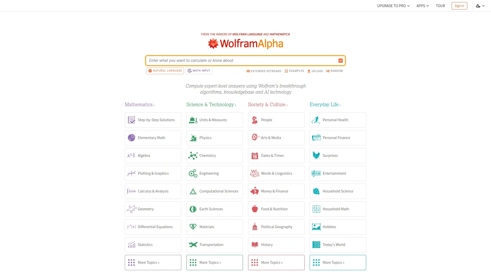

这不是传统搜索引擎,而是"计算知识引擎"。擅长回答需要计算的问题:数学方程求解、物理公式应用、统计分析、单位转换等。输入数据或方程,它会执行计算并展示详细步骤。

对STEM领域学生和研究者特别有用。可以生成图表、可视化数据、比较概念。知识库涵盖数学、科学、工程、金融等多个领域。基础功能免费,Pro版提供更多计算能力和无广告体验。

## **[Ecosia](https://www.ecosia.org/)**

环保搜索引擎,用搜索收入种树。

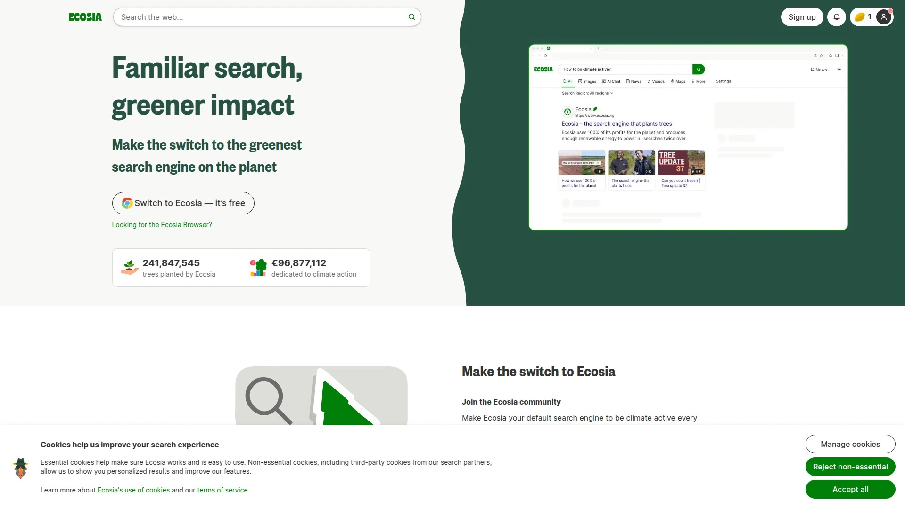

搜索结果来自必应,但商业模式很特别:将搜索广告收入的大部分用于植树项目。每搜索约45次,Ecosia就会种一棵树。可以在账户看到你"种"了多少树。

注重隐私,不出售数据给广告商,搜索记录匿名化。财务报告透明公开。对想用搜索做点好事的环保人士来说是好选择。完全免费,支持多平台。

## **[Startpage](https://www.startpage.com/)**

隐私搜索引擎,提供谷歌搜索结果但不追踪用户。

如果你想要谷歌的搜索质量但不想被追踪,Startpage是个好选择。它从谷歌获取搜索结果,但移除所有追踪器和个人标识符。你得到的是纯粹的搜索结果,没有个性化推荐,也没有追踪。

总部在荷兰,受欧洲严格隐私法保护。提供匿名查看功能,让你通过代理访问网站。界面简洁无广告干扰(或只有非追踪性广告)。适合注重隐私又想要高质量搜索结果的用户。免费使用。

## **[Mojeek](https://www.mojeek.com/)**

独立索引搜索引擎,运行自己的网络爬虫。

Mojeek是少数几个真正独立的搜索引擎,运行自己的爬虫MojeekBot建立索引,不依赖谷歌或必应。虽然索引规模比不上大厂,但在隐私保护和结果独立性上有优势。

不追踪用户,不过滤气泡(filter bubble),展示的是真实的网络而非算法认为你想看的。搜索结果可能不如谷歌全面,但对某些查询依然有效。适合追求搜索多样性和隐私的用户。完全免费。

## **[Yep](https://yep.com/)**

收益分享搜索引擎,将广告收入与内容创作者分享。

由Ahrefs(知名SEO工具公司)开发的搜索引擎。独特之处在于将90%的广告利润分给内容创作者,而非全部留给自己。用自己的技术和索引,不依赖其他搜索引擎。

承诺无追踪,注重用户隐私。搜索结果质量持续改进中,作为新兴搜索引擎还在成长阶段。对支持内容创作者生态的用户有吸引力。完全免费使用。

## **[Arc Search](https://arc.net/)**

移动优先的AI浏览器内置搜索,自动总结网页。

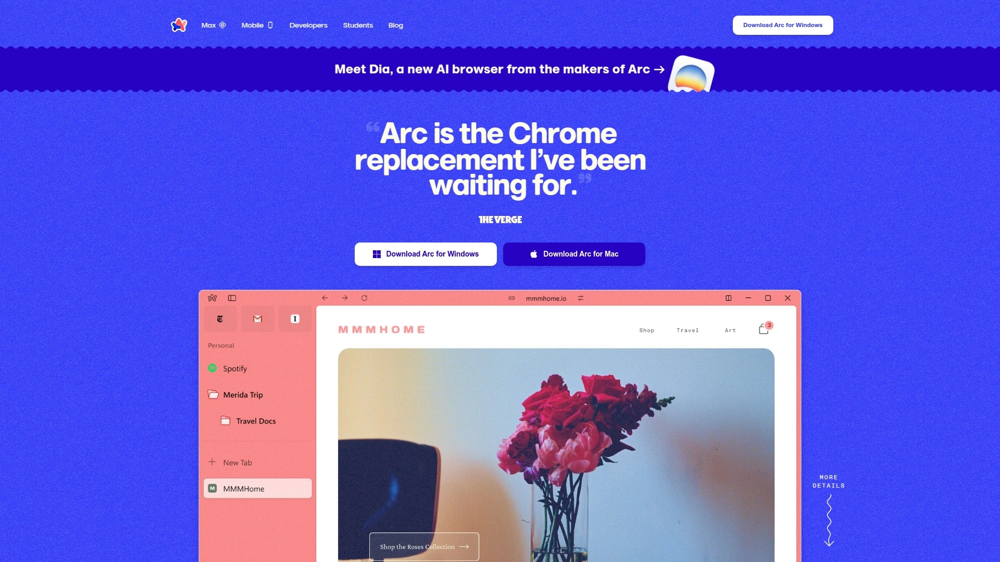

Arc Search是Arc浏览器的移动版本,主打功能是"Browse for Me"(替我浏览)。你输入查询,它会访问多个网页,阅读内容,然后生成一个自定义页面总结答案,省去你点开多个标签页的麻烦。

界面设计现代简洁,用户体验流畅。适合移动端快速获取信息。虽然是浏览器而非独立搜索引擎,但搜索体验足够独特值得一试。目前主要是iOS应用,免费使用。

## **[Openverse](https://openverse.org/)**

开源内容搜索引擎,查找可免费使用的图片、音频等。

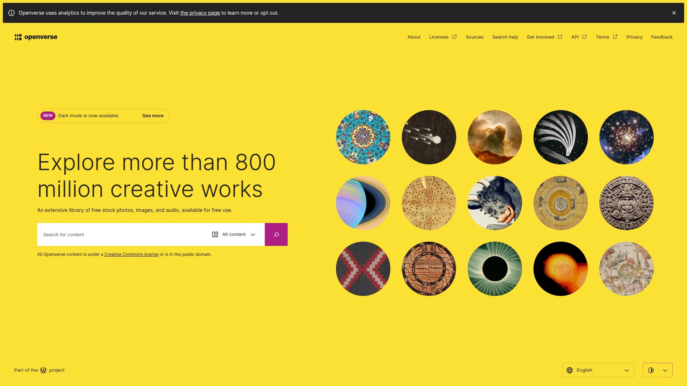

专门搜索标记为Creative Commons授权和公共领域的内容。如果你需要无版权问题的图片、音频、视频用于项目,Openverse是理想选择。搜索结果明确显示每个内容的具体授权类型。

涵盖来自多个平台的数亿个媒体文件。可以按授权类型、文件类型筛选。对内容创作者、设计师、教育工作者特别有用。完全免费,无需注册即可搜索和下载。

## **[Neeva](https://neeva.com/)**

订阅制无广告搜索引擎(已停止运营,但理念值得了解)。

虽然Neeva已在2023年关闭,但它的理念值得一提:用户付费订阅换取完全无广告、无追踪、无偏见的搜索体验。所有收入来自用户订阅而非广告,因此没有动力操纵结果或收集数据。

它的失败说明让用户为搜索付费依然很难,但也证明了市场对隐私和质量搜索的需求。可以作为案例研究了解搜索引擎商业模式的挑战。

***

## 常见问题

**如何选择适合自己的AI搜索工具?**

看你的具体需求:日常通用搜索选Perplexity或ChatGPT Search速度快答案准;学术研究选Consensus、Elicit或SciSpace能直接查论文提取数据;程序员选Phind懂技术术语给代码方案;注重隐私选Brave Search、Kagi或DuckDuckGo不追踪你。先试试免费版感受一下,再决定是否付费升级。

**免费工具和付费工具差别大吗?**

核心功能大多数免费版就能用,付费主要买的是更高使用限额、高级AI模型、无广告体验和额外特性。比如Perplexity免费每天有限次Pro搜索够日常用,重度用户才需要付费无限搜索。学术工具像Consensus、Elicit免费版每月几十次AI分析对轻度用户足够。如果你只是偶尔查查资料,免费版完全够用。

**这些AI搜索工具可靠吗,会不会给错误信息?**

都有可能出错,但带引用来源的工具(Perplexity、ChatGPT Search、Consensus)让你能验证信息更可靠。专门搜学术论文的工具(Consensus、Semantic Scholar)因为只用同行评审文献,准确度相对更高。通用AI搜索可能"编造"内容,所以重要决策前最好点进引用源头核实。多个工具交叉验证也是个好习惯。

***

## 结语

从通用搜索到学术研究,从技术开发到隐私保护,这28款工具覆盖了AI搜索和研究助手的各个方面。如果你不确定从哪个开始,[Perplexity](https://pplx.ai/ixkwood69619635)是个很好的起点——它在速度、准确度、引用质量之间找到了最佳平衡点,免费版就能应对大多数日常搜索和研究场景,还有深度研究功能帮你节省大量时间。具体选哪个还是要看你的工作流和需求,不妨多试几个找到最顺手的那款。
